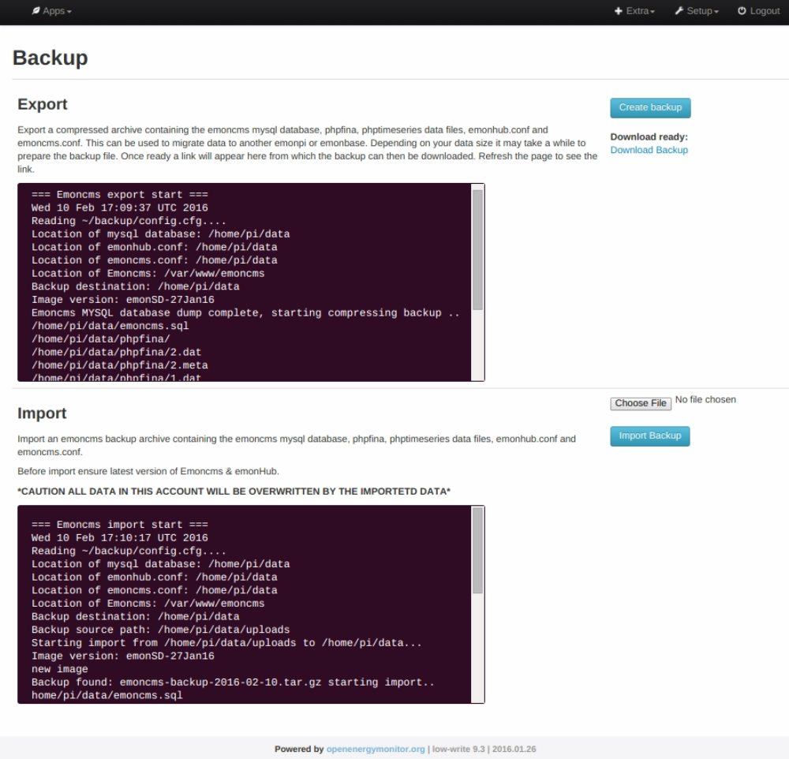

## Emoncms backup export and import tool for backup and migration

* Export a compressed archive containing Emoncms Inputs, Feed data, Dashboards & config.

*Backup contains the Emoncms MYSQL database, phpfina, phptimeseries data files, emonhub.conf and emoncms.conf*

* Import compressed archive into another Emoncms account


**Note: Import via Emoncms backup module web interface currently only work on emonPi, see manual steps below**

# Operation

## [Backup module User Guide](https://guide.openenergymonitor.org/setup/import/)

Via Emoncms module web interface [(see video screencast guide)](https://www.youtube.com/watch?v=5U_tOlsWjXM) or manual (see below for manual instructions):



## Manual Export Instructions

1. Configure paths in `config.cfg` to match your system (default emonPi)
2. Run `$ ~/backup/./emoncms-export.sh`

## Manual Import Instructions

If importing large backup files browser upload method may fail. In this case follow:

1. Configure paths in `config.cfg` to match your system (default emonPi)
2. Copy `emoncms-backup-xxx.tar.gz` backup file to `~/data/uploads` or whatever you have set as `data_source_path` in `config.cfg` via SSH or otherwise
3. Run `$ ~/backup/./emoncms-import.sh`

*Note: Default emonPi image has a RW ~/data partition with 150Mb of free space, size of uncompressed backup must be less. If using an SD card > 4GB (default emonPi is 8GB) the data partition can be expanded to fill the rest of the SD card. The `sdpart_imagefile` can be used to automate this. **Do not use raspi-config**.
```
  cd ~/usefulscripts
  rpi-rw
  git pull
  sudo /home/pi/usefulscripts/sdpart/./sdpart_imagefile
```
Follow on screen prompts, RasPi will shutdown when process is compleate. It can take over 20min! See more info in the [usefulscripts readme](https://github.com/emoncms/usefulscripts/blob/master/readme.md).

# Emoncms Module Install
 
 Install this module in your home folder then symlink the sub-folder called backup to your emoncms Modules directory:

    cd ~/
    git clone https://github.com/emoncms/backup.git
    ln -s /home/pi/backup/backup/ /var/www/emoncms/Modules/backup

**Note: 

- Ensure you are running the latest version of Emoncms on the Stable branch. [A change was merged on the 9th Feb 16 to Emoncms core](https://github.com/emoncms/emoncms/commit/e83ad78e6155275d7537104367b8d44ef63d78fe) that enables symlinked modules which is essential for backup module to appear in Emoncms**
- As of June 18 Backup module requires Redis to set service runner flags

**If your running the older 'low-write' branch of Emoncms emonSD-17Jun15 or before then you won't be able to update to the latest version to enable symlinks, to get around this after installing the module browse to [http://emonpi/emoncms/backup](http://emonpi/emoncms/backup)**

After updating a reboot or restart of apache will be required to enable symlinked modules:

    sudo service apache2 restart

## service-runner

The backup utility first requires service-runner to be running in the background on the emonpi/emonbase or other server that emoncms is running on. service-runner provides a way of starting background scripts from the emoncms UI so that when the 'create backup' button is clicked in the browser this first creates a flag in /tmp of the form /tmp/emoncms-flag-name. This flag file contains the location of the script to run and a log file. service-runner checks for flags every 1 seconds.

To install service-runner add the following entry to crontab (crontab -e):

    * * * * * ~/backup/service-runner >> /home/pi/data/service-runner.log 2>&1

or saving log in var log

    * * * * * ~/backup/service-runner >> /var/log/service-runner.log 2>&1

*Note: saving log in /var/log will require creating the log file and setting permissions at boot if mounting /var/log in tmpfs (default emonpi). [See entry in emonpi rc.local](https://github.com/openenergymonitor/emonpi/blob/master/rc.local_jessieminimal#L12)*

## PHP Config

In order to enable uploads of backup zip files we need to set the maximum upload size to be larger than the file we want to upload.

If running php5

If using php5

    sudo nano /etc/php5/apache2/php.ini
    
If runnning php7 (Stretch onwards)


    sudo nano /etc/php/7.0/apache2/php.ini
    
Use `[CTRL + W]` to search test

Set:

    post_max_size = 3G
    upload_max_filesize = 3G
    upload_tmp_dir = /home/pi/data/uploads

# Create uploads folder

## For emonPi / emonBase:

    sudo mkdir /home/pi/data/uploads
    sudo chown www-data /home/pi/data/uploads -R
    
## Config

Set paths in `config.cfg` to match your system. An example config is included for emonPi and non-emonPi setups. The default config.cgi is for emonPi
